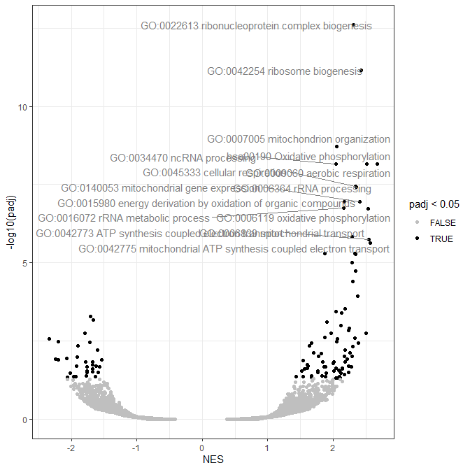
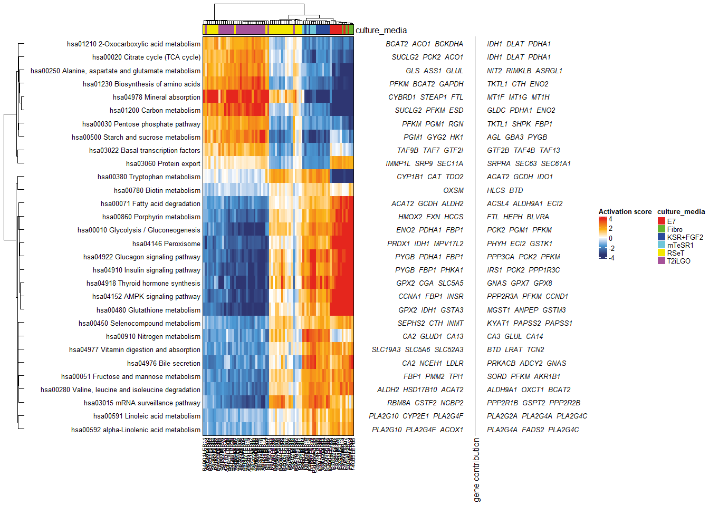

GSDS for functional enrichment analyses
================
Dimitri Meistermann
2024-03-16

GSDS (Gene Set Differential Scoring) is focused on functional
enrichment. The package has 3 purposes: - provide functions to manage
gene set databases - implement well known methods to perform functional
enrichment: over-representation analysis (ORA) and gene set enrichment
analysis (GSEA) - provide a new method to perform functional enrichment
based on differential scoring (GSDS)

The GSDS method computes an activation score for each gene set in each
sample using a PCA (similar to Pathway Level analysis of Gene Expression
or PLAGE). This gene score is used to identify gene sets that are
differentially activated between two conditions.

## Installation

In a R console:

    install.packages("devtools")

    #see oob github page if you encounter problems with installation
    devtools::install_github("https://github.com/DimitriMeistermann/oob", build_vignettes = FALSE)
    devtools::install_github("https://github.com/DimitriMeistermann/GSDS", build_vignettes = FALSE)

For a manual installation of dependencies:

    install.packages("BiocManager")
        BiocManager::install(c("AnnotationDbi", "fgsea", "gage", "ComplexHeatmap")

The package is ready to load.

``` r
  library(GSDS)
```

## Over representation analysis (ORA)

For any functional enrichment method, we have to first download several
gene set databases by using `getDBterms`. We will use here *kegg* and
the *Gene Ontology* (biological process). Note that you can use your own
database of gene sets.

``` r
library(oob) #provide functions to ease the use of R
data("DEgenesPrime_Naive")
#species specific package will be load/asked for installation
geneSetDB<-getDBterms(geneSym = rownames(DEgenesPrime_Naive), species = "Human", database = c("kegg","goBP"))
#> Gene ID type for 'human' is: 'EG'
geneSetDB$kegg[1:2]
#> $`hsa00970 Aminoacyl-tRNA biosynthesis`
#>  [1] "FARSB"   "WARS2"   "FARS2"   "PSTK"    "MTFMT"   "EARS2"   "FARSA"   "LARS2"   "HARS2"   "PARS2"   "GATC"    "YARS2"   "SEPSECS" "GATB"   
#> [15] "SARS2"   "DARS2"   "QRSL1"   "IARS2"   "RARS2"   "VARS2"   "AARS2"   "CARS2"   "NARS2"   "TARS2"   "MARS2"  
#> 
#> $`hsa02010 ABC transporters`
#>  [1] "ABCC5"  "ABCB6"  "ABCC9"  "ABCC4"  "ABCA7"  "ABCA10" "ABCA9"  "ABCA8"  "CFTR"   "ABCB8"  "ABCC2"  "ABCA13" "DEFB1"  "ABCA1"  "ABCA3"  "ABCB7" 
#> [17] "ABCB10" "ABCB9"  "ABCA6"  "ABCA5"  "ABCA12" "ABCB5"  "ABCC6"  "ABCC1"  "ABCB1"  "ABCB4"  "ABCD3"  "ABCD4"  "TAP1"   "TAP2"   "ABCC3"  "ABCC10"
#> [33] "ABCC12" "ABCG2"  "ABCG1"
```

Then we can make a simple over representation analysis.

``` r
vectorIsDE<-DEgenesPrime_Naive$isDE!="NONE";names(vectorIsDE)<-rownames(DEgenesPrime_Naive)
resEnrich<-enrich.ora(vectorIsDE,db_terms = geneSetDB)
head(resEnrich[whichTop(resEnrich$pval,decreasing = FALSE),])
#>                                                                                             term database nGene obsOverlap expectOverlap OEdeviation         pval        padj
#> goBP.GO:0044282 small molecule catabolic process     GO:0044282 small molecule catabolic process     goBP   309         89      53.45869   0.2729187 3.120740e-07 0.003784521
#> goBP.GO:0015711 organic anion transport                       GO:0015711 organic anion transport     goBP   327         91      56.57279   0.2643636 1.202117e-06 0.004188111
#> goBP.GO:0016054 organic acid catabolic process         GO:0016054 organic acid catabolic process     goBP   213         65      36.85017   0.2161602 1.381417e-06 0.004188111
#> goBP.GO:0046395 carboxylic acid catabolic process   GO:0046395 carboxylic acid catabolic process     goBP   213         65      36.85017   0.2161602 1.381417e-06 0.004188111
#> goBP.GO:1901605 alpha-amino acid metabolic process GO:1901605 alpha-amino acid metabolic process     goBP   164         53      28.37290   0.1891094 1.919049e-06 0.004654460
```

# functional class scoring (FCS)

The Functional class scoring family of functional enrichment is here
implemented by a wrapper of `fGSEA`. For any FCS method, we have to
build first a score at the gene level. I propose here a score for
Differentially Expressed genes based on inverse of p-value with the sign
of the Log2(Fold-change): \$(1-p) \$

``` r
fcsScore<-fcsScoreDEgenes(rownames(DEgenesPrime_Naive),DEgenesPrime_Naive$pvalue,DEgenesPrime_Naive$log2FoldChange)
resEnrich<-enrich.fcs(fcsScore,db_terms = geneSetDB,returnGenes = TRUE) #return genes of the gene set in the dataframe
head(resEnrich[whichTop(resEnrich$pval,decreasing = FALSE),])
#>                                             pathway         pval         padj   log2err        ES      NES size database        genes
#> 251 GO:0022613 ribonucleoprotein complex biogenesis 2.047554e-17 2.483069e-13 1.0768682 0.3517109 2.305008  441     goBP ADAR, AT....
#> 252                  GO:0042254 ribosome biogenesis 1.153096e-15 6.991795e-12 1.0175448 0.3855769 2.423578  304     goBP BYSL, C1....
#> 253           GO:0007005 mitochondrion organization 4.850739e-13 1.960830e-09 0.9214260 0.3090844 2.051455  493     goBP PARP1, A....
#> 254                  GO:0009060 aerobic respiration 2.728846e-12 6.972070e-09 0.8986712 0.4387256 2.515257  155     goBP ACLY, AC....
#> 255                     GO:0034470 ncRNA processing 3.138350e-12 6.972070e-09 0.8986712 0.3151104 2.037308  407     goBP ADAR, AK....

# The result can be visualized as a volcano plot
library(ggrepel)

ggplot(resEnrich,aes(x=NES,y=-log10(padj),color=padj<0.05))+
    geom_point()+theme_bw()+scale_color_manual(values=c("grey75","black"))+
    geom_text_repel(data = resEnrich[whichTop(resEnrich$pval,top = 15,decreasing = FALSE),],
    aes(x=NES,y=-log10(padj),label=pathway), inherit.aes = FALSE,color="grey50")
```



We can export enrichment with the genes of each gene set in a tsv file.

    exportEnrich(resEnrich,"test/resEnrich.tsv")

## Gene Set Differential Activation (GSDS)

We can also perform an enrichment based on gene set differential
activation with *GSDS*.

GSDS was developed independently from
[GSVA](https://bioconductor.org/packages/release/bioc/html/GSVA.html)
but is has the exact same idea of working on a matrix of gene set
scores. As *GSVA*, the first step is to translate the expression matrix
in an activation score matrix where each colum is a gene set and each
row is a sample.

The particularity of *GSDS* is to perform this step by taking the first
Principal Componant of the matrix $genesOfGeneSet \times samples$ from a
Principal Componant Analysis (PCA). One PCA is done per gene set and the
obtained values are the activation score for this particular gene set.
Hence, one PCA is performed for each gene set.

The activation score matrix is then used to perform differential
analysis with a linear model between two conditions.

``` r
data("bulkLogCounts")
data("sampleAnnot")
geneSetActivScore<-computeActivationScore(bulkLogCounts,db_terms = geneSetDB["kegg"])
resGSDS<-GSDS(geneSetActivScore = geneSetActivScore,colData = sampleAnnot,contrast = c("culture_media","T2iLGO","KSR+FGF2"),db_terms = geneSetDB["kegg"])
bestPathay<-whichTop(resGSDS$padj,top = 30,decreasing = FALSE)
bestPathayActivScore <- geneSetActivScore$kegg$activScoreMat[,bestPathay]
colnames(bestPathayActivScore)
#>  [1] "hsa00280 Valine, leucine and isoleucine degradation"  "hsa00030 Pentose phosphate pathway"                   "hsa00051 Fructose and mannose metabolism"            
#>  [4] "hsa04910 Insulin signaling pathway"                   "hsa04922 Glucagon signaling pathway"                  "hsa03022 Basal transcription factors"                
#>  [7] "hsa00450 Selenocompound metabolism"                   "hsa03015 mRNA surveillance pathway"                   "hsa03060 Protein export"                             
#> [10] "hsa00910 Nitrogen metabolism"                         "hsa01230 Biosynthesis of amino acids"                 "hsa04977 Vitamin digestion and absorption"           
#> [13] "hsa00860 Porphyrin metabolism"                        "hsa01210 2-Oxocarboxylic acid metabolism"             "hsa04152 AMPK signaling pathway"                     
#> [16] "hsa04976 Bile secretion"                              "hsa00500 Starch and sucrose metabolism"               "hsa04146 Peroxisome"                                 
#> [19] "hsa04978 Mineral absorption"                          "hsa04918 Thyroid hormone synthesis"                   "hsa00020 Citrate cycle (TCA cycle)"                  
#> [22] "hsa00480 Glutathione metabolism"                      "hsa01200 Carbon metabolism"                           "hsa00380 Tryptophan metabolism"                      
#> [25] "hsa00010 Glycolysis / Gluconeogenesis"                "hsa00591 Linoleic acid metabolism"                    "hsa00780 Biotin metabolism"                          
#> [28] "hsa00250 Alanine, aspartate and glutamate metabolism" "hsa00071 Fatty acid degradation"                      "hsa00592 alpha-Linolenic acid metabolism"
```

We can visualize the result as a heatmap with the contribution of each
gene to the score.

``` r

heatmap.DM( t(bestPathayActivScore) ,midColorIs0 = TRUE,center=FALSE,
    name = "Activation score",preSet = NULL,colData = sampleAnnot["culture_media"],
    right_annotation=rowAnnotation("gene contribution" =
        GSDS.HeatmapAnnot(contributions = geneSetActivScore$kegg$contribution[bestPathay],width = unit(12,"cm"),fontsizeFactor = 300)
    ),
    row_names_side ="left",row_dend_side ="left",
    row_names_max_width = unit(8, "inches"),autoFontSizeRow=FALSE,row_names_gp=gpar(fontsize=1/length(bestPathay)*300)
)
```



