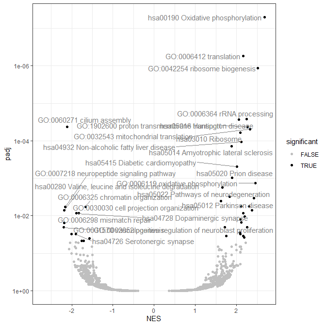
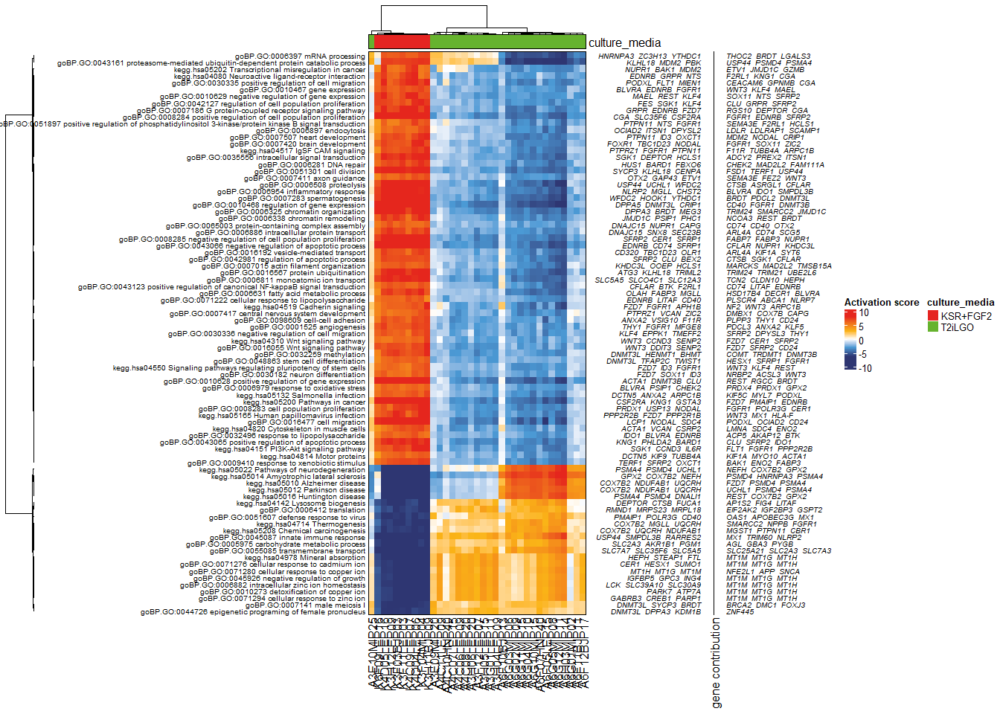
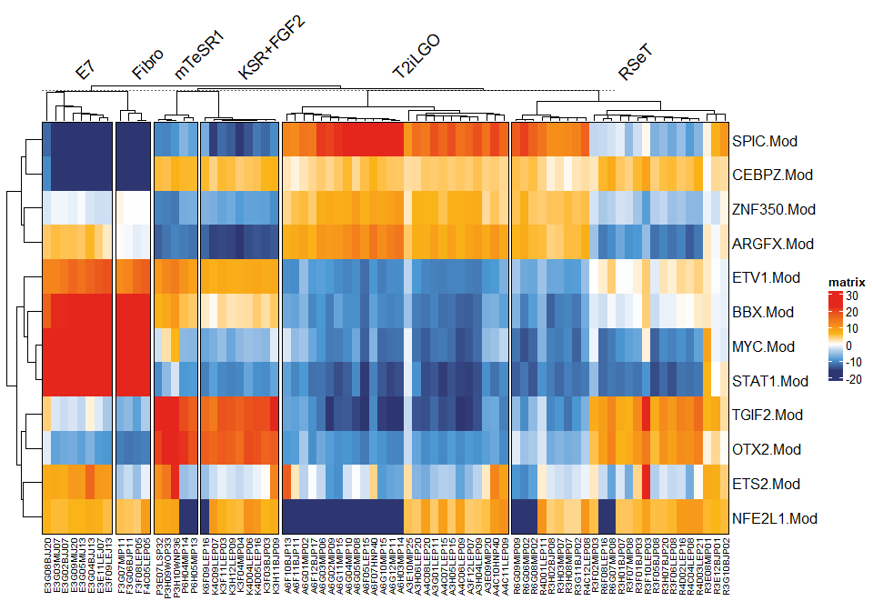
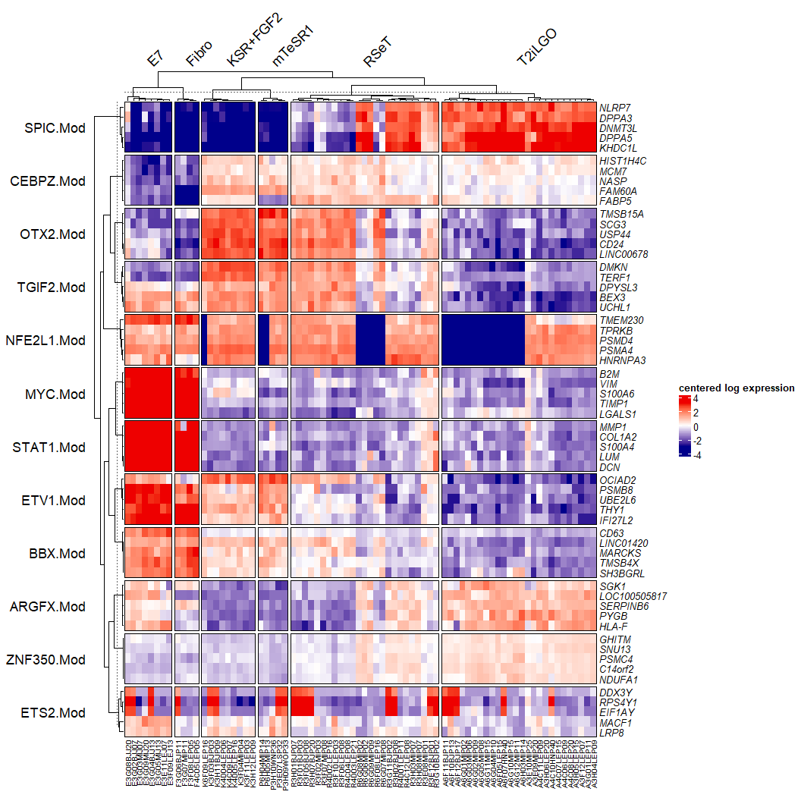

GSDS for functional enrichment analyses
================
Dimitri Meistermann
2025-12-17

GSDS (Gene Set Differential Scoring) is focused on functional
enrichment. The package has 3 purposes: - provide functions to manage
gene set databases - implement well known methods to perform functional
enrichment: over-representation analysis (ORA) and gene set enrichment
analysis (GSEA) - provide a new method to perform functional enrichment
based on differential scoring (GSDS)

The GSDS method computes an activation score for each gene set in each
sample using a PCA (similar to Pathway Level analysis of Gene Expression
or PLAGE). This gene score is used to identify gene sets that are
differentially activated between two conditions.

## Installation

In a R console:

    install.packages("devtools")

    #see oob github page if you encounter problems with installation
    devtools::install_github("https://github.com/DimitriMeistermann/oob", build_vignettes = FALSE)
    devtools::install_github("https://github.com/DimitriMeistermann/GSDS", build_vignettes = FALSE)

For a manual installation of dependencies:

    install.packages("BiocManager")
        BiocManager::install(c("AnnotationDbi", "fgsea", "gage", "ComplexHeatmap")

The package is ready to load.

``` r
  library(GSDS)
```

## Over representation analysis (ORA)

For any functional enrichment method, we have to first download several
gene set databases by using `getDBterms`. We will use here *kegg* and
the *Gene Ontology* (biological process). Note that you can use your own
database of gene sets.

``` r
library(oob) #provide functions to ease the use of R
#> Loading required package: ggplot2
#> Loading required package: ComplexHeatmap
#> Loading required package: grid
#> ========================================
#> ComplexHeatmap version 2.26.0
#> Bioconductor page: http://bioconductor.org/packages/ComplexHeatmap/
#> Github page: https://github.com/jokergoo/ComplexHeatmap
#> Documentation: http://jokergoo.github.io/ComplexHeatmap-reference
#> 
#> If you use it in published research, please cite either one:
#> - Gu, Z. Complex Heatmap Visualization. iMeta 2022.
#> - Gu, Z. Complex heatmaps reveal patterns and correlations in multidimensional 
#>     genomic data. Bioinformatics 2016.
#> 
#> 
#> The new InteractiveComplexHeatmap package can directly export static 
#> complex heatmaps into an interactive Shiny app with zero effort. Have a try!
#> 
#> This message can be suppressed by:
#>   suppressPackageStartupMessages(library(ComplexHeatmap))
#> ========================================
#> Loading required package: SingleCellExperiment
#> Loading required package: SummarizedExperiment
#> Loading required package: MatrixGenerics
#> Loading required package: matrixStats
#> 
#> Attaching package: 'MatrixGenerics'
#> The following objects are masked from 'package:matrixStats':
#> 
#>     colAlls, colAnyNAs, colAnys, colAvgsPerRowSet, colCollapse, colCounts, colCummaxs, colCummins, colCumprods, colCumsums,
#>     colDiffs, colIQRDiffs, colIQRs, colLogSumExps, colMadDiffs, colMads, colMaxs, colMeans2, colMedians, colMins, colOrderStats,
#>     colProds, colQuantiles, colRanges, colRanks, colSdDiffs, colSds, colSums2, colTabulates, colVarDiffs, colVars, colWeightedMads,
#>     colWeightedMeans, colWeightedMedians, colWeightedSds, colWeightedVars, rowAlls, rowAnyNAs, rowAnys, rowAvgsPerColSet,
#>     rowCollapse, rowCounts, rowCummaxs, rowCummins, rowCumprods, rowCumsums, rowDiffs, rowIQRDiffs, rowIQRs, rowLogSumExps,
#>     rowMadDiffs, rowMads, rowMaxs, rowMeans2, rowMedians, rowMins, rowOrderStats, rowProds, rowQuantiles, rowRanges, rowRanks,
#>     rowSdDiffs, rowSds, rowSums2, rowTabulates, rowVarDiffs, rowVars, rowWeightedMads, rowWeightedMeans, rowWeightedMedians,
#>     rowWeightedSds, rowWeightedVars
#> Loading required package: GenomicRanges
#> Loading required package: stats4
#> Loading required package: BiocGenerics
#> Loading required package: generics
#> 
#> Attaching package: 'generics'
#> The following objects are masked from 'package:base':
#> 
#>     as.difftime, as.factor, as.ordered, intersect, is.element, setdiff, setequal, union
#> 
#> Attaching package: 'BiocGenerics'
#> The following objects are masked from 'package:stats':
#> 
#>     IQR, mad, sd, var, xtabs
#> The following objects are masked from 'package:base':
#> 
#>     anyDuplicated, aperm, append, as.data.frame, basename, cbind, colnames, dirname, do.call, duplicated, eval, evalq, Filter, Find,
#>     get, grep, grepl, is.unsorted, lapply, Map, mapply, match, mget, order, paste, pmax, pmax.int, pmin, pmin.int, Position, rank,
#>     rbind, Reduce, rownames, sapply, saveRDS, table, tapply, unique, unsplit, which.max, which.min
#> Loading required package: S4Vectors
#> 
#> Attaching package: 'S4Vectors'
#> The following object is masked from 'package:utils':
#> 
#>     findMatches
#> The following objects are masked from 'package:base':
#> 
#>     expand.grid, I, unname
#> Loading required package: IRanges
#> 
#> Attaching package: 'IRanges'
#> The following object is masked from 'package:grDevices':
#> 
#>     windows
#> Loading required package: Seqinfo
#> Loading required package: Biobase
#> Welcome to Bioconductor
#> 
#>     Vignettes contain introductory material; view with 'browseVignettes()'. To cite Bioconductor, see 'citation("Biobase")', and for
#>     packages 'citation("pkgname")'.
#> 
#> Attaching package: 'Biobase'
#> The following object is masked from 'package:MatrixGenerics':
#> 
#>     rowMedians
#> The following objects are masked from 'package:matrixStats':
#> 
#>     anyMissing, rowMedians
data("DEgenesPrime_Naive")
#species specific package will be load/asked for installation
geneSetDB<-getDBterms(geneSym = rownames(DEgenesPrime_Naive), species = "Human", database = c("kegg","goBP"))
#> 
#> Loading required package: org.Hs.eg.db
#> Loading required package: AnnotationDbi
#> Gene ID type for 'human' is: 'EG'
geneSetDB$kegg[1:2]
#> $`hsa00970 Aminoacyl-tRNA biosynthesis`
#>  [1] "FARSB"   "WARS2"   "FARS2"   "PSTK"    "MTFMT"   "EARS2"   "FARSA"   "LARS2"   "HARS2"   "PARS2"   "GATC"    "YARS2"   "SEPSECS" "GATB"   
#> [15] "SARS2"   "DARS2"   "QRSL1"   "IARS2"   "RARS2"   "VARS2"   "AARS2"   "CARS2"   "NARS2"   "TARS2"   "MARS2"  
#> 
#> $`hsa02010 ABC transporters`
#>  [1] "ABCC5"  "ABCB6"  "ABCC9"  "ABCC4"  "ABCA7"  "ABCA10" "ABCA9"  "ABCA8"  "CFTR"   "ABCB8"  "ABCC2"  "ABCA13" "DEFB1"  "ABCA1"  "ABCA3"  "ABCB7" 
#> [17] "ABCB10" "ABCB9"  "ABCA6"  "ABCA5"  "ABCA12" "ABCB5"  "ABCC6"  "ABCC1"  "ABCB1"  "ABCB4"  "ABCD3"  "ABCD4"  "TAP1"   "TAP2"   "ABCC3"  "ABCC10"
#> [33] "ABCC12" "ABCG2"  "ABCG1"
```

Then we can make a simple over representation analysis.

``` r
vectorIsDE<-DEgenesPrime_Naive$isDE!="NONE";names(vectorIsDE)<-rownames(DEgenesPrime_Naive)
resEnrich<-enrich.ora(vectorIsDE,db_terms = geneSetDB)
head(resEnrich[whichTop(resEnrich$pval,decreasing = FALSE),])
#>                                                                                             term database size obsOverlap expectOverlap OEdeviation
#> goBP.GO:0044282 small molecule catabolic process     GO:0044282 small molecule catabolic process     goBP  303         87      52.42066   0.2655318
#> goBP.GO:1901605 alpha-amino acid metabolic process GO:1901605 alpha-amino acid metabolic process     goBP  158         52      27.33487   0.1894015
#> goBP.GO:0015711 organic anion transport                       GO:0015711 organic anion transport     goBP  342         94      59.16788   0.2674729
#> goBP.GO:0016054 organic acid catabolic process         GO:0016054 organic acid catabolic process     goBP  207         63      35.81214   0.2087733
#> goBP.GO:0046395 carboxylic acid catabolic process   GO:0046395 carboxylic acid catabolic process     goBP  207         63      35.81214   0.2087733
#>                                                            pval        padj
#> goBP.GO:0044282 small molecule catabolic process   4.887536e-07 0.005211886
#> goBP.GO:1901605 alpha-amino acid metabolic process 1.292349e-06 0.005211886
#> goBP.GO:0015711 organic anion transport            1.457947e-06 0.005211886
#> goBP.GO:0016054 organic acid catabolic process     2.203198e-06 0.005211886
#> goBP.GO:0046395 carboxylic acid catabolic process  2.203198e-06 0.005211886
```

# functional class scoring (FCS)

The Functional class scoring family of functional enrichment is here
implemented by a wrapper of `fGSEA`. For any FCS method, we have to
build first a score at the gene level. I propose here a score for
Differentially Expressed genes based on inverse of p-value with the sign
of the Log2(Fold-change): \$(1-p) \$

``` r
fcsScore<-fcsScoreDEgenes(rownames(DEgenesPrime_Naive),DEgenesPrime_Naive$pvalue,DEgenesPrime_Naive$log2FoldChange)
resEnrich<-enrich.fcs(fcsScore,db_terms = geneSetDB,returnGenes = TRUE) #return genes of the gene set in the dataframe
head(resEnrich[whichTop(resEnrich$pval,decreasing = FALSE),])
#>                                                                                                 term database size         pval         padj
#> goBP.GO:0022613 ribonucleoprotein complex biogenesis GO:0022613 ribonucleoprotein complex biogenesis     goBP  434 3.748434e-18 4.433647e-14
#> goBP.GO:0042254 ribosome biogenesis                                   GO:0042254 ribosome biogenesis     goBP  296 2.332350e-16 1.379352e-12
#> goBP.GO:0006364 rRNA processing                                           GO:0006364 rRNA processing     goBP  212 5.155676e-12 1.876780e-08
#> kegg.hsa00190 Oxidative phosphorylation                           hsa00190 Oxidative phosphorylation     kegg  101 6.346905e-12 1.876780e-08
#> goBP.GO:0006119 oxidative phosphorylation                       GO:0006119 oxidative phosphorylation     goBP  110 3.058027e-11 7.234069e-08
#>                                                        log2err        ES      NES        genes
#> goBP.GO:0022613 ribonucleoprotein complex biogenesis 1.0959293 0.3588621 2.361717 ADAR, AT....
#> goBP.GO:0042254 ribosome biogenesis                  1.0376962 0.3914458 2.459826 BYSL, C1....
#> goBP.GO:0006364 rRNA processing                      0.8870750 0.3945960 2.398897 BYSL, CD....
#> kegg.hsa00190 Oxidative phosphorylation              0.8870750 0.5095867 2.700566 COX17, T....
#> goBP.GO:0006119 oxidative phosphorylation            0.8513391 0.4863124 2.638562 ACTN3, A....

# The result can be visualized as a volcano plot
library(ggrepel)

ggplot(resEnrich,aes(x=NES,y=-log10(padj),color=padj<0.05))+
    geom_point()+theme_bw()+scale_color_manual(values=c("grey75","black"))+
    geom_text_repel(data = resEnrich[whichTop(resEnrich$pval,top = 15,decreasing = FALSE),],
    aes(x=NES,y=-log10(padj),label=term), inherit.aes = FALSE,color="grey50")
```



We can export enrichment with the genes of each gene set in a tsv file.

    exportEnrich(resEnrich,"test/resEnrich.tsv")

## Gene Set Differential Activation (GSDS)

We can also perform an enrichment based on gene set differential
activation with *GSDS*.

GSDS was developed independently from
[GSVA](https://bioconductor.org/packages/release/bioc/html/GSVA.html)
but is has the exact same idea of working on a matrix of gene set
scores. As *GSVA*, the first step is to translate the expression matrix
in an activation score matrix where each colum is a gene set and each
row is a sample.

The particularity of *GSDS* is to perform this step by taking the first
Principal Componant of the matrix $genesOfGeneSet \times samples$ from a
Principal Componant Analysis (PCA). One PCA is done per gene set and the
obtained values are the activation score for this particular gene set.
Hence, one PCA is performed for each gene set.

The activation score matrix is then used to perform differential
analysis with a linear model between two conditions.

``` r
data("bulkLogCounts")
data("sampleAnnot")
geneSetActivScore<-computeActivationScore(bulkLogCounts,db_terms = geneSetDB["kegg"])
resGSDS<-GSDS(geneSetActivScore = geneSetActivScore,colData = sampleAnnot,contrast = c("culture_media","T2iLGO","KSR+FGF2"),db_terms = geneSetDB["kegg"])
bestPathay<-whichTop(resGSDS$padj,top = 30,decreasing = FALSE)
bestPathayActivScore <- geneSetActivScore$kegg$activScoreMat[,bestPathay]
colnames(bestPathayActivScore)
#>  [1] "hsa00051 Fructose and mannose metabolism"             "hsa00280 Valine, leucine and isoleucine degradation" 
#>  [3] "hsa00030 Pentose phosphate pathway"                   "hsa04910 Insulin signaling pathway"                  
#>  [5] "hsa04922 Glucagon signaling pathway"                  "hsa03022 Basal transcription factors"                
#>  [7] "hsa00450 Selenocompound metabolism"                   "hsa03015 mRNA surveillance pathway"                  
#>  [9] "hsa03060 Protein export"                              "hsa00910 Nitrogen metabolism"                        
#> [11] "hsa04977 Vitamin digestion and absorption"            "hsa01230 Biosynthesis of amino acids"                
#> [13] "hsa01210 2-Oxocarboxylic acid metabolism"             "hsa00860 Porphyrin metabolism"                       
#> [15] "hsa04152 AMPK signaling pathway"                      "hsa04976 Bile secretion"                             
#> [17] "hsa00500 Starch and sucrose metabolism"               "hsa04146 Peroxisome"                                 
#> [19] "hsa04978 Mineral absorption"                          "hsa04918 Thyroid hormone synthesis"                  
#> [21] "hsa00020 Citrate cycle (TCA cycle)"                   "hsa00480 Glutathione metabolism"                     
#> [23] "hsa01200 Carbon metabolism"                           "hsa00380 Tryptophan metabolism"                      
#> [25] "hsa00010 Glycolysis / Gluconeogenesis"                "hsa00591 Linoleic acid metabolism"                   
#> [27] "hsa00780 Biotin metabolism"                           "hsa00250 Alanine, aspartate and glutamate metabolism"
#> [29] "hsa00071 Fatty acid degradation"                      "hsa00592 alpha-Linolenic acid metabolism"
```

We can visualize the result as a heatmap with the contribution of each
gene to the score.

``` r

heatmap.DM( t(bestPathayActivScore) ,midColorIs0 = TRUE,center=FALSE,
    name = "Activation score",preSet = NULL,colData = sampleAnnot["culture_media"],
    right_annotation=rowAnnotation("gene contribution" =
        GSDS.HeatmapAnnot(contributions = geneSetActivScore$kegg$contribution[bestPathay],width = unit(12,"cm"),fontsizeFactor = 300)
    ),
    row_names_side ="left",row_dend_side ="left",
    row_names_max_width = unit(8, "inches"),autoFontSizeRow=FALSE,row_names_gp=gpar(fontsize=1/length(bestPathay)*300)
)
```



## New! Compute gene modules!

Here the gene modules (gene coexpression clusters) are computed with a
Leiden clustering, by default, from a correlation distance matrix. The
activation scores are then computed for each module for a quick
visualization.

A good practice is to rename module names by an important leading gene
in each module. Here we rename the modules using the JASPAR
transcription factor (TF) database. The best TF of each module in term
of PC1 contribution will be used to rename the module

``` r
humanTFs <- dl_JAFAR_geneSyms()

geneModules <- computegenemodules(bulkLogCounts, TF_list = humanTFs)

heatmap.DM(t(geneModules$activation_score), preSet = NULL, column_split = sampleAnnot["culture_media"], column_title_rot = 45)
```


We can also make a more detailed heatmap with the top genes in term of
contributions for each heatmap

``` r
topGenes <- lapply(geneModules$module_genes, function(moduleGenes) {
    contribsOfMod <-  geneModules$gene_annot[moduleGenes, "Contribution"]
    names(contribsOfMod) <- moduleGenes
    names(contribsOfMod)[order(contribsOfMod, decreasing = TRUE)][seq_len(5)]
}) |> oob::VectorListToFactor()

heatmap.DM(
    bulkLogCounts[names(topGenes), ],
    column_split = sampleAnnot["culture_media"],
    column_title_rot = 45,
    row_split = topGenes, row_title_rot = 0
)
```



